# PDF Generator Project Structure

```plaintext
pdf-generator-project/
├── src/
│   ├── main/
│   │   ├── java/
│   │   │   └── com/
│   │   │       └── hamzaelkhatib/
│   │   │           └── pdfgenerator/
│   │   │               ├── controller/
│   │   │               │   └── PdfController.java
│   │   │               ├── config/
│   │   │               │   ├── ConfigProperties.java
│   │   │               │   └── AsyncConfig.java
│   │   │               ├── service/
│   │   │               │   ├── PdfGeneratorService.java
│   │   │               │   ├── FileCleanupService.java
│   │   │               │   └── PdfTaskManager.java
│   │   │               ├── utils/
│   │   │               │   ├── PdfUtils.java
│   │   │               │   └── CookieHelper.java
│   │   │               └── PdfGeneratorApplication.java
│   │   └── resources/
│   │       └── application.yml
└── pom.xml
```


# Dependency Documentation

| Name                    | Dependency                                          | Maintainer(s)                         | License                     | Version               | Commercial Use        | Uses in Project                                      |
|-------------------------|----------------------------------------------------|---------------------------------------|-----------------------------|-----------------------|-----------------------|-----------------------------------------------------|
| Spring Boot Starter Web | `org.springframework.boot:spring-boot-starter-web` | Pivotal Software                      | Apache License 2.0          | 3.3.5                 | Yes                   | Provides the web framework to build RESTful APIs for PDF generation requests. |
| Lombok                  | `org.projectlombok:lombok`                        | Project Lombok                       | MIT License                 | -                     | Yes                   | Reduces boilerplate code in the model and service classes, improving code readability and maintenance. |
| Spring Boot Starter Test| `org.springframework.boot:spring-boot-starter-test`| Pivotal Software                      | Apache License 2.0          | 3.3.5                 | Yes                   | Facilitates unit and integration testing of the application. |
| Playwright              | `com.microsoft.playwright:playwright`              | Microsoft                             | MIT License                 | 1.28.0                | Yes                   | Used for generating PDFs by rendering HTML content in a headless browser environment. |
| PDFBox                  | `org.apache.pdfbox:pdfbox`                         | The Apache Software Foundation        | Apache License 2.0          | 2.0.27                | Yes                   | Handles the creation, manipulation, and merging of PDF files generated by the application. |
| SLF4J API              | `org.slf4j:slf4j-api`                             | SLF4J Team                            | MIT License                 | 2.0.7                 | Yes                   | Provides a logging abstraction to log important events and errors in the application. |

# Process Steps

## 1. Initial Setup

- The application receives a request to process articles.
- Articles are divided into chunks based on the configured batch size and articles per PDF.

## 2. Chunk Generation

- Each chunk is processed in parallel.
- The PDF for each chunk is generated and temporarily saved.
- Average processing time per chunk is determined by system performance.

## 3. Finalization

- All generated PDFs are merged into a final output PDF.
- The final PDF is compressed to reduce file size.
- Temporary files used during processing are cleaned up to free resources.

# Architecture Diagram

```mermaid
graph TD
    start(["🚀 Start"]) --> controller["📥 PdfController"]
    controller -->|"Generate UUID"| pending["Create Pending File"]
    pending --> generateAsync["🔄 generatePdfAsync"]
    
    subgraph URL_GEN["🔗 URL Generation"]
        style URL_GEN fill:#2E2E2E,stroke:#F8B229,stroke-width:2px
        generateUrls["Generate URLs"] --> splitBatch["Split into Batches"]
    end

    subgraph BATCH_PROC["⚡ Batch Processing"]
        style BATCH_PROC fill:#2E2E2E,stroke:#FF47A0,stroke-width:2px
        batch["Process Batch"] --> playwright["🎭 Playwright"]
        playwright --> pdf["Generate PDF"]
        pdf --> removePages["Remove Last Pages"]
    end

    subgraph MERGE["📑 Final Processing"]
        style MERGE fill:#2E2E2E,stroke:#00FF00,stroke-width:2px
        mergeChunks["Merge PDFs"] --> deletePending["Delete Pending File"]
        deletePending --> cleanup["Delete Chunks"]
    end

    generateAsync --> URL_GEN
    URL_GEN --> BATCH_PROC
    BATCH_PROC --> MERGE

    subgraph STATUS["📊 Status Checking"]
        style STATUS fill:#2E2E2E,stroke:#FF47A0,stroke-width:2px
        check{"Check Status"} -->|Pending| pending_response["Return 204"]
        check -->|Completed| serve["Serve PDF"]
        check -->|Not Found| notfound["Return Message"]
    end

    MERGE --> check
```


# Cleanup Schedule Diagram


