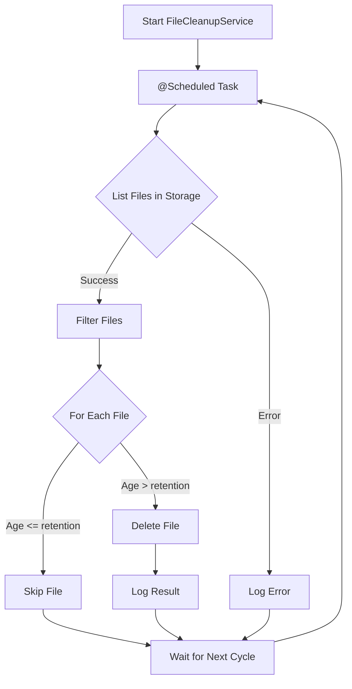

# PDF Generator Documentation

## Table of Contents
- [1. Project Overview](#1-project-overview)
  - [Project Structure](#project-structure)
  - [Dependencies](#dependencies)
- [2. Configuration](#2-configuration)
  - [YAML Configuration Reference](#yaml-configuration-reference)
- [3. Setup Instructions](#3-setup-instructions)
  - [Playwright Installation](#playwright-installation)
- [4. API Documentation](#4-api-documentation)
- [5. Process Flow](#5-process-flow)
  - [Main Process Flow](#main-process-flow)
  - [Cleanup Process](#cleanup-process)

## 1. Project Overview

### Project Structure
```plaintext
pdf-generator-project/
├── src/
│   ├── main/
│   │   ├── java/
│   │   │   └── com/
│   │   │       └── hamzaelkhatib/
│   │   │           └── pdfgenerator/
│   │   │               ├── controller/
│   │   │               │   └── PdfController.java
│   │   │               ├── config/
│   │   │               │   ├── ConfigProperties.java
│   │   │               │   └── AsyncConfig.java
│   │   │               ├── service/
│   │   │               │   ├── PdfGeneratorService.java
│   │   │               │   ├── FileCleanupService.java
│   │   │               │   └── PdfTaskManager.java
│   │   │               ├── utils/
│   │   │               │   ├── PdfUtils.java
│   │   │               │   └── CookieHelper.java
│   │   │               └── PdfGeneratorApplication.java
│   │   └── resources/
│   │       └── application.yml
└── pom.xml
```

### Dependencies

| Name | Dependency | Maintainer(s) | License | Version | Commercial Use | Uses in Project |
|------|------------|---------------|----------|----------|----------------|-----------------|
| Spring Boot Starter Web | `org.springframework.boot:spring-boot-starter-web` | Pivotal Software | Apache License 2.0 | 3.3.5 | Yes | Web framework for RESTful APIs |
| Lombok | `org.projectlombok:lombok` | Project Lombok | MIT License | - | Yes | Reduces boilerplate code |
| Spring Boot Starter Test | `org.springframework.boot:spring-boot-starter-test` | Pivotal Software | Apache License 2.0 | 3.3.5 | Yes | Testing framework |
| Playwright | `com.microsoft.playwright:playwright` | Microsoft | MIT License | 1.28.0 | Yes | PDF generation from HTML |
| PDFBox | `org.apache.pdfbox:pdfbox` | Apache Software Foundation | Apache License 2.0 | 2.0.27 | Yes | PDF manipulation and merging |
| SLF4J API | `org.slf4j:slf4j-api` | SLF4J Team | MIT License | 2.0.7 | Yes | Logging abstraction |

## 2. Configuration

### YAML Configuration Reference

#### PDF Generation Settings
| Parameter | Description | Default Value | Notes |
|-----------|-------------|---------------|-------|
| `pdf.storage.path` | Directory path for PDF storage | `/data/generated_pdfs` | Absolute path to store generated PDFs |
| `pdf.pages-to-remove` | Number of pages to remove from end | 2 | Removes specified pages from each chunk |

#### Cleanup Configuration
| Parameter | Description | Default Value | Notes |
|-----------|-------------|---------------|-------|
| `pdf.cleanup.file-retention-duration-ms` | File retention duration | 1800000 | 30 minutes in milliseconds |
| `pdf.cleanup.cleanup-interval-ms` | Cleanup check interval | 600000 | 10 minutes in milliseconds |

#### Ranking Service Configuration
| Parameter | Description | Default Value | Notes |
|-----------|-------------|---------------|-------|
| `pdf.ranking.root` | Base URL for PDF export | `https://comercial.central.inditex.grp/cdarkspa-st4/web/export` | Export service URL |
| `pdf.ranking.domain` | Domain for cookie settings | `comercial.central.inditex.grp` | Used for cookie configuration |
| `pdf.ranking.environment` | Environment identifier | `local` | Environment setting |
| `pdf.ranking.articles-per-pdf` | Articles per PDF chunk | 200 | Number of articles in each PDF section |
| `pdf.ranking.batch-size` | Concurrent PDF generations | 2 | Number of PDFs generated simultaneously |

#### Execution Configuration
| Parameter | Description | Default Value | Notes |
|-----------|-------------|---------------|-------|
| `pdf.executor.pool-size` | Thread pool size | 1 | Number of concurrent threads |

#### Server Configuration
| Parameter | Description | Default Value | Notes |
|-----------|-------------|---------------|-------|
| `cors.allowed-origin` | Allowed CORS origin | `https://comercial.central.inditex.grp` | CORS configuration |
| `server.port` | Server port | 8080 | Application port |
| `spring.application.name` | Application name | pdfgenerator | Service identifier |

### Example Configuration
```yaml
pdf:
    storage:
        path: /data/generated_pdfs
    cleanup:
        file-retention-duration-ms: 1800000  # 30 minutes
        cleanup-interval-ms: 600000          # 10 minutes
    ranking:
        root: "https://comercial.central.inditex.grp/cdarkspa-st4/web/export"
        domain: "comercial.central.inditex.grp"
        environment: "local"
        articles-per-pdf: 200
        batch-size: 2
    executor:
        pool-size: 1
    pages-to-remove: 2

cors:
    allowed-origin: "https://comercial.central.inditex.grp"

server:
    port: 8080

spring:
    application:
        name: pdfgenerator
```
## 3. Setup Instructions

### Playwright Installation
```bash
# Install Playwright
mvn exec:java -e -D exec.mainClass=com.microsoft.playwright.CLI -D exec.args="install"

# Install browser
mvn exec:java -e -D exec.mainClass=com.microsoft.playwright.CLI -D exec.args="install chromium"
```

## 4. API Documentation

### Endpoints

#### 1. Generate PDF
```http
GET /api/v1/generateRankingPdf
```

**Query Parameters:**
- `dataUrl` (required): Source data URL
- `numberOfArticles` (required): Number of articles to process

**Headers:**
- `Cookie` (required): Authentication cookies

**Response:**
```json
{
    "taskId": "/api/v1/checkPdfStatus?taskId=uuid"
}
```

#### 2. Check Status
```http
GET /api/v1/checkPdfStatus
```

**Query Parameters:**
- `taskId` (required): Task UUID

**Responses:**
- `200 OK` with PDF file: Generation complete
- `204 No Content`: In progress
- `200 OK` with message: File not found

## 5. Process Flow

### Main Process Flow

```mermaid
%%{init: {
  'theme': 'dark',
  'themeVariables': {
    'primaryColor': '#2E2E2E',
    'primaryTextColor': '#fff',
    'primaryBorderColor': '#7C0097',
    'lineColor': '#F8B229',
    'secondaryColor': '#006100',
    'tertiaryColor': '#001F5C'
  }
}}%%

graph TB
    start(["🚀 Start"]) --> controller["📥 PdfController"]
    controller -->|"Generate UUID"| pending["Create Pending File"]
    pending --> generateAsync["🔄 generatePdfAsync"]
    
    subgraph URL_GEN["🔗 URL Generation"]
        style URL_GEN fill:#2E2E2E,stroke:#F8B229,stroke-width:2px
        generateUrls["Generate URLs"] --> splitBatch["Split into chunks of 200"]
    end

    subgraph BATCH_PROC["⚡ Batch Processing - 2 at a time"]
        style BATCH_PROC fill:#2E2E2E,stroke:#FF47A0,stroke-width:2px
        subgraph BATCH1["Batch 1"]
            style BATCH1 fill:#1E3D58,stroke:#00A8E8
            p1["Chunk 1"] --- p2["Chunk 2"]
        end
        
        subgraph BATCH2["Batch 2"]
            style BATCH2 fill:#1E3D58,stroke:#00A8E8
            p3["Chunk 3"] --- p4["Chunk 4"]
        end
        
        BATCH1 --> BATCH2
        
        process["For each chunk:"] --> playwright["🎭 Playwright"]
        playwright --> pdf["Generate PDF"]
        pdf --> removePages["Remove Last 2 Pages"]
    end

    subgraph MERGE["📑 Final Processing"]
        style MERGE fill:#2E2E2E,stroke:#00FF00,stroke-width:2px
        mergeChunks["Merge PDFs"] --> deletePending["Delete Pending File"]
        deletePending --> cleanup["Delete Chunks"]
    end

    generateAsync --> URL_GEN
    URL_GEN --> BATCH_PROC
    BATCH_PROC --> MERGE

    subgraph STATUS["📊 Status Checking"]
        style STATUS fill:#2E2E2E,stroke:#FF47A0,stroke-width:2px
        check{"Check Status"} -->|Pending| pending_response["Return 204"]
        check -->|Completed| serve["Serve PDF"]
        check -->|Not Found| notfound["Return Message"]
    end

    MERGE --> check

    classDef default fill:#2E2E2E,stroke:#7C0097,stroke-width:2px,color:#fff
    classDef process fill:#1E3D58,stroke:#00A8E8,stroke-width:2px,color:#fff
    classDef note fill:#006100,stroke:#00FF00,stroke-width:2px,color:#fff
    
    class generateAsync,mergeChunks process
    class start,check note
```


#### Process Steps
1. **Initial Setup**
   - Application receives request to process articles
   - Articles divided into chunks based on configuration

2. **Chunk Generation**
   - Each chunk processed in parallel
   - PDF generated and temporarily saved
   - Processing time varies with system performance

3. **Finalization**
   - Generated PDFs merged into final output
   - Final PDF compressed
   - Temporary files cleaned up

### Cleanup Process

