# PDF Generation Process Documentation

## Overview
This document explains the process of generating PDFs from large datasets of articles (demonstrated with 5,000 articles). The system uses parallel processing with resource-optimized batch sizes and efficient memory management.

## Architecture Diagram

```mermaid
%%{init: {
  'theme': 'dark',
  'themeVariables': {
    'primaryColor': '#2E2E2E',
    'primaryTextColor': '#fff',
    'primaryBorderColor': '#7C0097',
    'lineColor': '#F8B229',
    'secondaryColor': '#006100',
    'tertiaryColor': '#001F5C'
  }
}}%%
graph TD
    start(["🚀 Start"]) --> input["📚 5,000 Articles"]
    input --> chunk["🔄 Split into 25 chunks"]
    
    subgraph CHUNKS["📦 25 Chunks Created"]
        style CHUNKS fill:#2E2E2E,stroke:#F8B229,stroke-width:2px
        c1["Chunk 1: 0-200"] --- c2["Chunk 2: 201-400"]
        c2 --- c3["Chunk 3: 401-600"]
        c3 --- cdots["..."]
        cdots --- c24["Chunk 24: 4601-4800"]
        c24 --- c25["Chunk 25: 4801-5000"]
    end

    subgraph PARALLEL["⚡ Parallel Processing - 2 at a time"]
        style PARALLEL fill:#2E2E2E,stroke:#FF47A0,stroke-width:2px
        
        subgraph BATCH1["Batch 1"]
            style BATCH1 fill:#1E3D58,stroke:#00A8E8
            p1["Chunk 1"] --- p2["Chunk 2"]
        end
        
        subgraph BATCH2["Batch 2"]
            style BATCH2 fill:#1E3D58,stroke:#00A8E8
            p3["Chunk 3"] --- p4["Chunk 4"]
        end
        
        subgraph BATCH13["Batch 13"]
            style BATCH13 fill:#1E3D58,stroke:#00A8E8
            p25["Chunk 25"]
        end
        
        BATCH1 --> BATCH2
        BATCH2 --> dots[". . ."]
        dots --> BATCH13
    end

    subgraph PROCESSING["🔄 Each Chunk Processing"]
        style PROCESSING fill:#2E2E2E,stroke:#00FF00,stroke-width:2px
        d1["1. Generate PDF Buffer"] --> d2["2. Write to temp file"]
        d2 --> d3["3. Save as chunk-N.pdf"]
    end

    subgraph MERGE["📑 Merge Process"]
        style MERGE fill:#2E2E2E,stroke:#FF47A0,stroke-width:2px
        m1["Merge 2 PDFs at a time"] --> m2["Total: 351 pages"]
        m2 --> m3["Time: ~600ms"]
    end

    chunk --> CHUNKS
    CHUNKS --> PARALLEL
    PROCESSING --> PARALLEL
    PARALLEL --> MERGE
    MERGE --> compress["🗜️ Compress PDF\n127.38 MB, 715ms"]
    compress --> cleanup["🧹 Cleanup temp files"]
    cleanup --> finish(["🏁 End\nTotal: 98.01 seconds"])
```

## Process Steps

1. **Initial Setup**
   - System receives a request to process articles
   - Articles are divided into chunks of 200 articles each (RANKING_PDF_ARTICLES_PER_PDF)
   - For 5,000 articles, this creates 25 chunks

2. **Parallel Processing**
   - System processes 2 chunks simultaneously (RANKING_PDF_BATCH_SIZE)
   - Each chunk generates its own PDF (~5MB per chunk)
   - Processing continues in batches of 2 until all chunks are complete
   - Average chunk processing time: ~7.3 seconds

3. **Finalization**
   - Merge process handles 2 PDFs at a time (MERGE_BATCH_SIZE)
   - Final PDF is compressed
   - All temporary files are cleaned up

## Timeline

```mermaid
%%{init: {
  'theme': 'dark',
  'themeVariables': {
    'primaryColor': '#2E2E2E',
    'primaryTextColor': '#fff',
    'primaryBorderColor': '#7C0097',
    'lineColor': '#F8B229',
    'secondaryColor': '#006100',
    'tertiaryColor': '#001F5C'
  }
}}%%
gantt
    title PDF Generation Timeline (5,000 Articles)
    dateFormat ss
    axisFormat %M:%S
    
    section 🚀 Setup
    Split into chunks      :active, a1, 0, 1s
    
    section ⚡ Batch Processing
    Batch 1 (Chunks 1-2)  :crit, a2, after a1, 7.8s
    Batch 2 (Chunks 3-4)  :crit, a3, after a2, 7.8s
    Batch 3 (Chunks 5-6)  :crit, a4, after a3, 7.3s
    Remaining Batches     :crit, a5, after a4, 70s
    Final Chunk           :crit, a6, after a5, 7.3s
    
    section 🔄 Finalization
    Merge PDFs            :a7, after a6, 0.6s
    Compress              :a8, after a7, 0.7s
    Cleanup              :a9, after a8, 0.001s
```

## Processing Times

| Phase | Time | Description |
|-------|------|-------------|
| Setup | ~1ms | Initial chunking of articles |
| Each Full Batch | ~7.5s | Processing 2 chunks in parallel |
| Final Batch | ~7.3s | Processing last single chunk |
| Merge | 606ms | Combining all PDFs (351 pages) |
| Compression | 715ms | Optimizing final PDF (127.38 MB) |
| Cleanup | 1ms | Removing temporary files |

## Resource Configuration
- CPU Limit: 4 cores
- Memory Limit: 8Gi
- RANKING_PDF_ARTICLES_PER_PDF: 200
- RANKING_PDF_BATCH_SIZE: 2
- MERGE_BATCH_SIZE: 2

## Performance Metrics
- Total Processing Time: 98.01 seconds for 5,000 articles
- Average Chunk Size: ~5 MB
- Final PDF Size: 127.38 MB
- Total Pages Generated: 351
- Average Processing Rate: ~51 articles per second

## Error Handling
- Each chunk processes independently
- Failed chunks trigger cleanup of temporary files
- Batch failures don't affect completed batches
- Automatic cleanup of all temporary files, even during errors