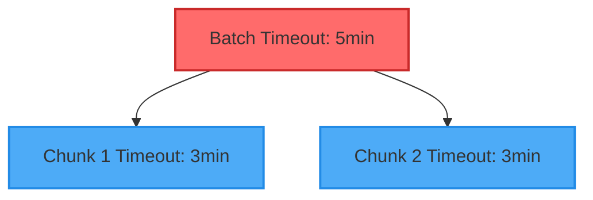

# PDF Generation Timeouts Documentation

## Overview
This document outlines the timeout configurations in our PDF generation process. These timeouts are designed to prevent system hangs and ensure proper resource management.

## Timeout Configuration

### Application-Level Timeouts
```diff
# Process Control Timeouts
+ CHUNK_TIMEOUT: 180000ms (3 minutes)
+ BATCH_TIMEOUT: 300000ms (5 minutes)
```

### Playwright Browser Timeouts
```diff
# Browser Operation Timeouts
+ Page Navigation: 1800000ms (30 minutes)
+ Element Wait: 1800000ms (30 minutes)
+ PDF Generation: 1800000ms (30 minutes)
```

## Timeout Hierarchy


## Timeout Summary Matrix

| Level | Duration | Purpose | Trigger Point |
|-------|----------|---------|---------------|
| `Chunk` | 3 minutes | Individual PDF generation | Start of chunk processing |
| `Batch` | 5 minutes | Parallel chunk processing | Start of batch processing |
| `Page Load` | 30 minutes | Browser page navigation | Page load start |
| `Element Wait` | 30 minutes | DOM element detection | Element wait start |
| `PDF Generation` | 30 minutes | PDF creation in browser | PDF generation start |

## System Behavior

| Scenario | When Hit | System Response | Recovery |
|----------|----------|-----------------|----------|
| `Page Load` | 30m | Fail chunk | Retry chunk |
| `Element Wait` | 30m | Fail chunk | Retry chunk |
| `Chunk Processing` | 3m | Fail chunk | Next chunk |
| `Batch Processing` | 5m | Fail batch | Exit process |
| `PDF Generation` | 30m | Fail chunk | Retry chunk |

## Resource Management
- All temporary files cleaned up on timeout
- Browser instances terminated
- Memory released
- System resources freed

## Related System Limits
```yaml
Hardware:
  CPU: 4 cores
  Memory: 8Gi

Processing:
  RANKING_PDF_ARTICLES_PER_PDF: 200
  RANKING_PDF_BATCH_SIZE: 2
  MERGE_BATCH_SIZE: 2
```